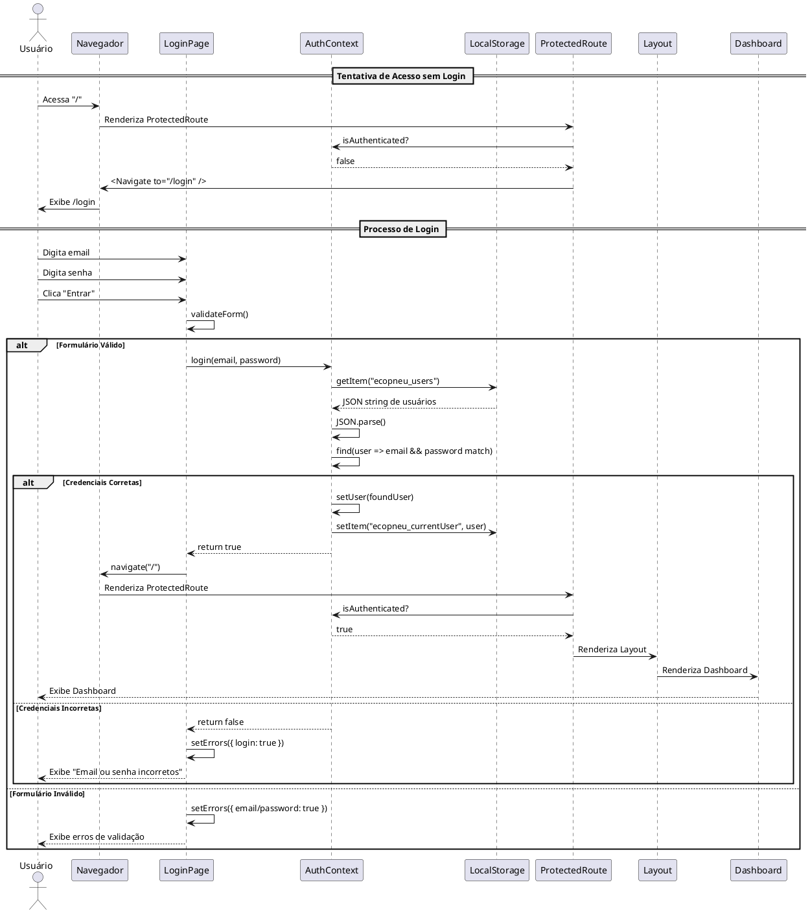
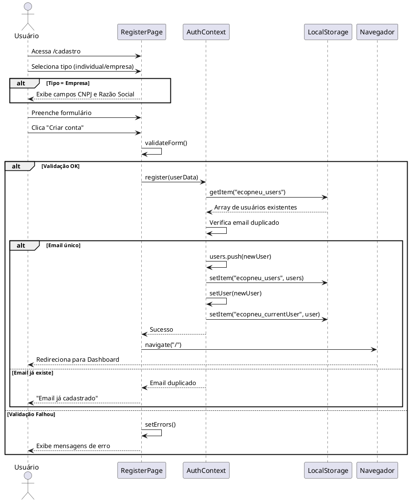
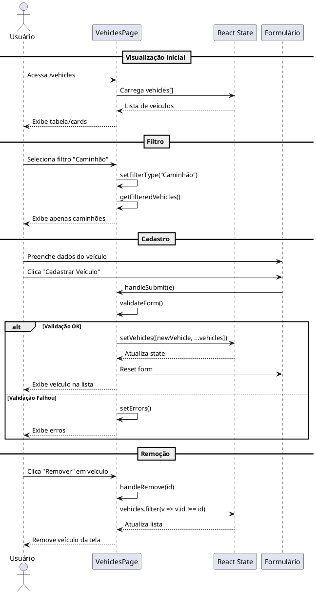
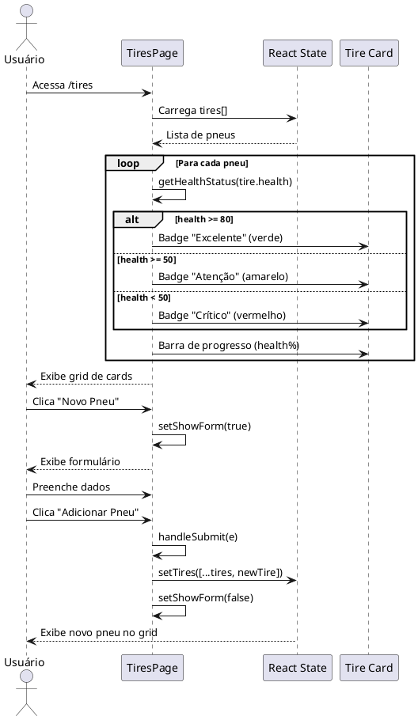
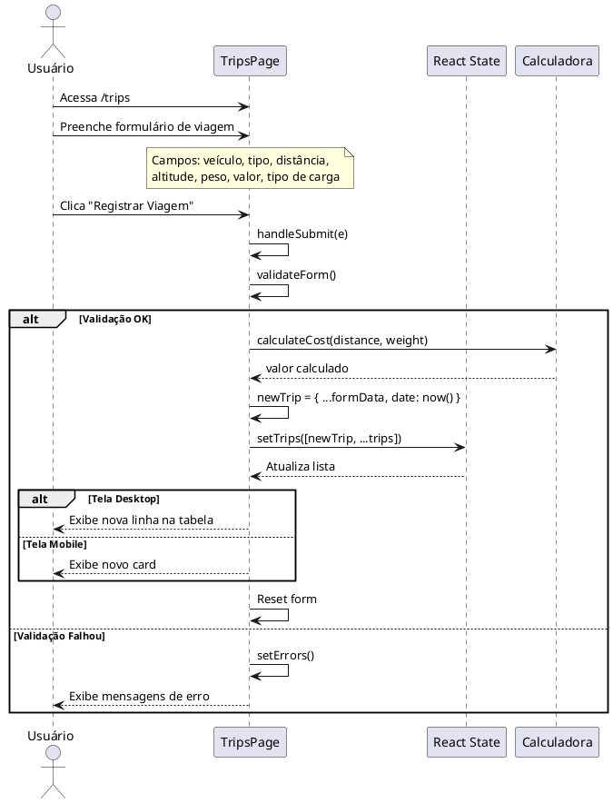
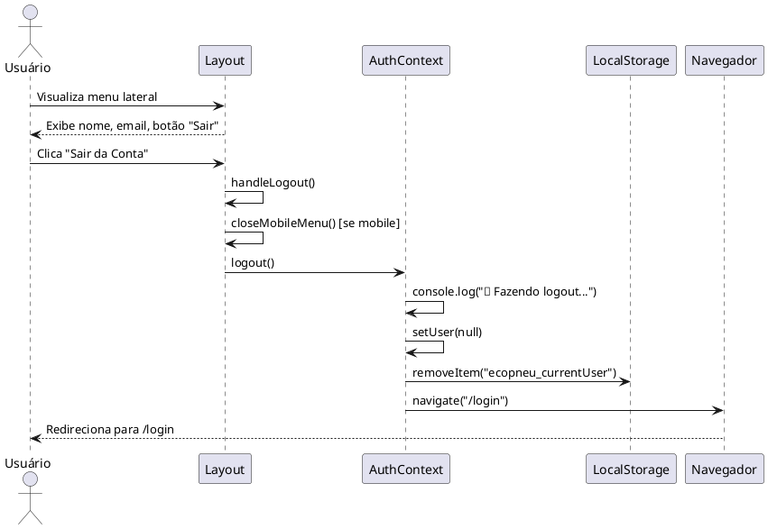
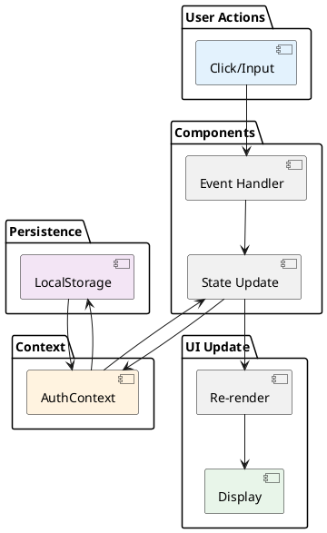

# Arquitetura do Sistema EcoPneu

## Visão Geral

Sistema web de gestão de frota e veículos com foco em sustentabilidade e monitoramento de pneus.

## Diagramas de Sequência Detalhados

### 1. Fluxo Completo de Autenticação



### 2. Fluxo de Registro de Usuário



### 3. Fluxo de Gerenciamento de Veículos



### 4. Fluxo de Monitoramento de Pneus



### 5. Fluxo de Registro de Viagem



### 6. Fluxo de Logout



## Estrutura de Pastas

```
src/
├── app/
│   ├── components/
│   │   ├── ui/              # Componentes UI reutilizáveis
│   │   │   ├── button.tsx
│   │   │   ├── card.tsx
│   │   │   ├── input.tsx
│   │   │   └── ...
│   │   ├── Layout.tsx       # Layout principal com menu
│   │   ├── ProtectedRoute.tsx  # Proteção de rotas
│   │   ├── Button.tsx       # Botão customizado
│   │   ├── Card.tsx         # Card customizado
│   │   └── Input.tsx        # Input customizado
│   │
│   ├── contexts/
│   │   └── AuthContext.tsx  # Contexto de autenticação
│   │
│   ├── pages/
│   │   ├── Dashboard.tsx    # Página principal
│   │   ├── Vehicles.tsx     # Gestão de veículos
│   │   ├── Tires.tsx        # Gestão de pneus
│   │   ├── Trips.tsx        # Gestão de viagens
│   │   ├── NewLogin.tsx     # Página de login
│   │   └── Register.tsx     # Página de registro
│   │
│   ├── App.tsx              # Componente raiz
│   └── routes.tsx           # Configuração de rotas
│
├── styles/
│   ├── theme.css            # Tema Tailwind
│   └── fonts.css            # Importação de fontes
│
└── docs/                    # Documentação
    ├── diagrama-casos-de-uso.md
    ├── diagrama-classes.md
    └── arquitetura-sistema.md
```

## Tecnologias Utilizadas

### Frontend
| Tecnologia | Versão | Uso |
|------------|--------|-----|
| React | 19 | Framework UI |
| TypeScript | Latest | Tipagem estática |
| React Router | 7.13.0 | Roteamento |
| Tailwind CSS | 4.0 | Estilização |
| Recharts | 2.15.2 | Gráficos |
| Lucide React | Latest | Ícones |
| Vite | Latest | Build tool |

### Persistência
| Tecnologia | Uso |
|------------|-----|
| LocalStorage | Armazenamento de usuários e sessão |
| React State | Estado local dos componentes |
| React Context | Estado global (autenticação) |

## Decisões de Arquitetura

### 1. Por que React Context para autenticação?
- ✅ Estado global acessível em toda aplicação
- ✅ Evita prop drilling
- ✅ Performance adequada para este caso de uso
- ✅ Fácil integração com Protected Routes

### 2. Por que LocalStorage?
- ✅ Persistência simples sem necessidade de backend
- ✅ Dados disponíveis offline
- ✅ Adequado para protótipo/MVP
- ⚠️ Limitação: Não é seguro para produção (usar backend real)

### 3. Por que Protected Routes?
- ✅ Segurança de navegação
- ✅ Experiência do usuário melhorada
- ✅ Código mais organizado
- ✅ Reutilizável

### 4. Por que Tailwind CSS v4?
- ✅ Utility-first para desenvolvimento rápido
- ✅ Responsividade nativa
- ✅ Customização via CSS variables
- ✅ Performance otimizada

## Fluxo de Dados



## Performance e Otimizações

### Implementadas
- ✅ Lazy loading de rotas
- ✅ Memoização de cálculos (health status, badges)
- ✅ Componentes controlados para forms
- ✅ Keys únicas em listas
- ✅ CSS otimizado (Tailwind purge)

### Sugestões para Produção
- 🔄 Implementar React.memo em componentes pesados
- 🔄 Usar useMemo para filtros complexos
- 🔄 Implementar virtual scrolling para listas grandes
- 🔄 Code splitting por rota
- 🔄 Service Workers para cache

## Segurança

### Implementado
- ✅ Protected Routes
- ✅ Validação de formulários
- ✅ Sanitização de inputs
- ✅ Verificação de sessão

### Para Produção
- 🔒 Implementar backend com autenticação JWT
- 🔒 HTTPS obrigatório
- 🔒 Rate limiting em login
- 🔒 Criptografia de senhas (bcrypt)
- 🔒 CSRF protection
- 🔒 XSS protection
- 🔒 SQL injection prevention

## Escalabilidade

### Limitações Atuais
- LocalStorage limitado a ~5MB
- Sem paginação em listas
- Sem otimização de renderização em listas grandes

### Melhorias Futuras
- Migrar para backend REST/GraphQL
- Implementar banco de dados (PostgreSQL)
- Adicionar paginação
- Implementar busca server-side
- Cache com Redis
- CDN para assets

---

**Documentação gerada para o sistema EcoPneu v1.0**
