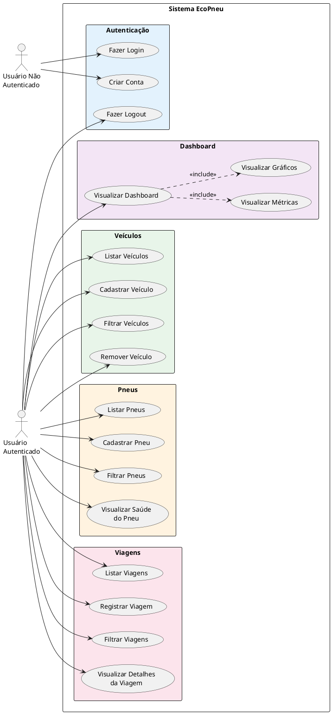
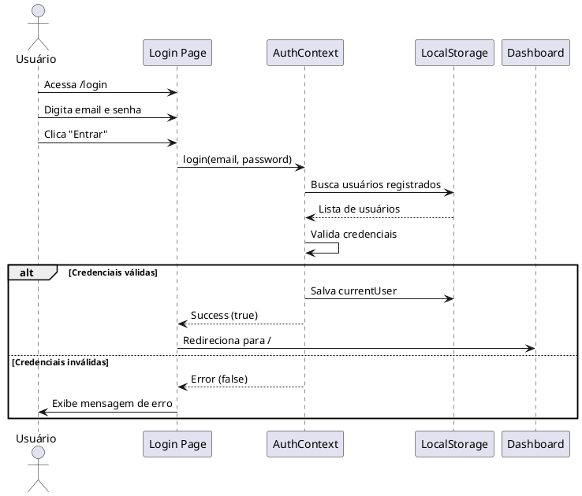
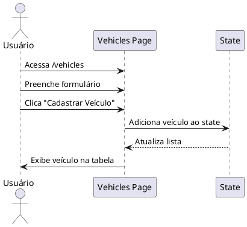
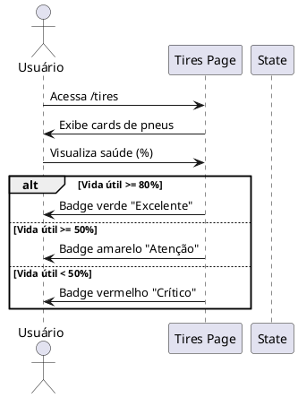

# Diagrama de Casos de Uso - Sistema EcoPneu

## Diagrama Principal

## Descrição dos Casos de Uso

### 📋 Módulo de Autenticação

| Caso de Uso | Ator | Descrição |
|-------------|------|-----------|
| **UC1 - Fazer Login** | Usuário Não Autenticado | Permite que o usuário acesse o sistema com email e senha |
| **UC2 - Criar Conta** | Usuário Não Autenticado | Permite cadastro de novo usuário (pessoa física ou empresa) |
| **UC3 - Fazer Logout** | Usuário Autenticado | Permite que o usuário saia do sistema |

### 📊 Módulo Dashboard

| Caso de Uso | Ator | Descrição |
|-------------|------|-----------|
| **UC4 - Visualizar Dashboard** | Usuário Autenticado | Exibe visão geral do sistema |
| **UC5 - Visualizar Métricas** | Sistema | Exibe cards com vida média dos pneus, veículos, etc. |
| **UC6 - Visualizar Gráficos** | Sistema | Exibe gráficos de viagens, custos e saúde dos pneus |

### 🚗 Módulo Veículos

| Caso de Uso | Ator | Descrição |
|-------------|------|-----------|
| **UC7 - Listar Veículos** | Usuário Autenticado | Exibe todos os veículos cadastrados |
| **UC8 - Cadastrar Veículo** | Usuário Autenticado | Adiciona novo veículo (caminhão, carro, moto) |
| **UC9 - Filtrar Veículos** | Usuário Autenticado | Filtra veículos por tipo |
| **UC10 - Remover Veículo** | Usuário Autenticado | Remove veículo da lista |

### 🛞 Módulo Pneus

| Caso de Uso | Ator | Descrição |
|-------------|------|-----------|
| **UC11 - Listar Pneus** | Usuário Autenticado | Exibe todos os pneus cadastrados |
| **UC12 - Cadastrar Pneu** | Usuário Autenticado | Adiciona novo pneu vinculado a um veículo |
| **UC13 - Filtrar Pneus** | Usuário Autenticado | Filtra pneus por tipo de veículo |
| **UC14 - Visualizar Saúde do Pneu** | Usuário Autenticado | Visualiza vida útil e status do pneu |

### 🗺️ Módulo Viagens

| Caso de Uso | Ator | Descrição |
|-------------|------|-----------|
| **UC15 - Listar Viagens** | Usuário Autenticado | Exibe todas as viagens registradas |
| **UC16 - Registrar Viagem** | Usuário Autenticado | Registra nova viagem com dados de distância, peso, etc. |
| **UC17 - Filtrar Viagens** | Usuário Autenticado | Filtra viagens por tipo de veículo |
| **UC18 - Visualizar Detalhes da Viagem** | Usuário Autenticado | Exibe informações detalhadas da viagem |

## Fluxos Principais

### 🔐 Fluxo de Autenticação

### 🚗 Fluxo de Cadastro de Veículo

### 🛞 Fluxo de Monitoramento de Pneus

## Regras de Negócio

### Autenticação
- RN01: Senha deve ter no mínimo 6 caracteres
- RN02: Email deve ser válido e único
- RN03: Usuário pode ser Pessoa Física ou Empresa
- RN04: Empresa deve informar CNPJ e razão social

### Veículos
- RN05: Tipos permitidos: Caminhão, Carro, Moto
- RN06: Placa é obrigatória e deve ser única
- RN07: Ano do veículo deve ser informado

### Pneus
- RN08: Pneu deve estar vinculado a um veículo
- RN09: Vida útil é medida de 0% a 100%
- RN10: Status é calculado automaticamente pela vida útil
- RN11: Eixo pode ser Dianteiro ou Traseiro

### Viagens
- RN12: Distância, altitude e peso são obrigatórios
- RN13: Valor é calculado com base na distância
- RN14: Tipo de carga deve ser informado
- RN15: Data é registrada automaticamente

---

**Legenda:**
- 🔵 Autenticação
- 🟣 Dashboard
- 🟢 Veículos
- 🟠 Pneus
- 🔴 Viagens
