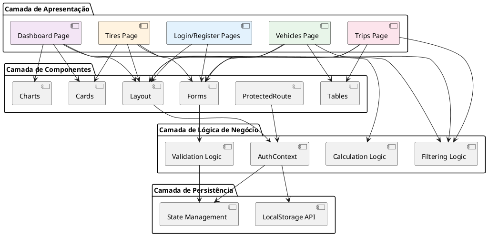

: boolean
    +validate(): boolean
}

class Vehicle <<Domain>> #e8f5e9 {
    +id: number
    +type: VehicleType
    +brand: string
    +model: string
    +year: string
    +plate: string
    +createdAt: Date
    +getTypeIcon(): Icon
    +getBadgeColor(): string
    +toString(): string
}

class Tire <<Domain>> #f3e5f5 {
    +id: number
    +model: string
    +brand: string
    +axis: TireAxis
    +health: number
    +vehicleType: VehicleType
    +vehicle: string
    +createdAt: Date
    +getHealthStatus(): HealthStatus
    +getHealthColor(): string
    +getHealthLabel(): string
    +needsReplacement(): boolean
}

class Trip <<Domain>> #fce4ec {
    +id: number
    +vehicle: string
    +vehicleType: VehicleType
    +distance: number
    +altitude: number
    +weight: number
    +value: number
    +type: string
    +date: Date
    +status: TripStatus
    +calculateCost(): number
    +getFormattedValue(): string
    +getDuration(): number
}

class Metric <<Domain>> {
    +title: string
    +value: string
    +icon: Icon
    +color: string
    +change: string
    +type: MetricType
    +calculate(): number
    +format(): string
}

' ============================================
' CLASSES DE CONTEXTO
' ============================================

class AuthContext <<Context>> #fff3e0 {
    -currentUser: User?
    -registeredUsers: User[]
    +login(email, password): boolean
    +register(userData): void
    +logout(): void
    +isAuthenticated(): boolean
    +getCurrentUser(): User?
    -validateCredentials(email, password): boolean
    -saveToLocalStorage(): void
    -loadFromLocalStorage(): void
}

' ============================================
' CLASSES DE COMPONENTES
' ============================================

class Layout <<Component>> {
    -isMobileMenuOpen: boolean
    -location: Location
    +closeMobileMenu(): void
    +isActive(path): boolean
    +handleLogout(): void
    +getUserInitials(): string
    +render(): ReactElement
}

class Dashboard <<Component>> {
    -metricsData: Metric[]
    -recentTrips: Trip[]
    -chartData: ChartData[]
    -tireHealthData: TireHealthData[]
    +render(): ReactElement
}

class VehiclesPage <<Component>> {
    -vehicles: Vehicle[]
    -formData: FormData
    -errors: Errors
    -filterType: string
    +handleSubmit(event): void
    +handleRemove(id): void
    +setFilterType(type): void
    +getFilteredVehicles(): Vehicle[]
    +render(): ReactElement
}

class TiresPage <<Component>> {
    -tires: Tire[]
    -formData: FormData
    -errors: Errors
    -showForm: boolean
    -filterType: string
    +handleSubmit(event): void
    +toggleForm(): void
    +setFilterType(type): void
    +getFilteredTires(): Tire[]
    +render(): ReactElement
}

class TripsPage <<Component>> {
    -trips: Trip[]
    -formData: FormData
    -errors: Errors
    -filterType: string
    +handleSubmit(event): void
    +setFilterType(type): void
    +getFilteredTrips(): Trip[]
    +calculateValue(): number
    +render(): ReactElement
}

class LoginPage <<Component>> {
    -formData: FormData
    -errors: Errors
    -showPassword: boolean
    +handleSubmit(event): void
    +togglePasswordVisibility(): void
    +validateForm(): boolean
    +render(): ReactElement
}

class RegisterPage <<Component>> {
    -formData: FormData
    -errors: Errors
    -userType: UserType
    -showPassword: boolean
    +handleSubmit(event): void
    +togglePasswordVisibility(): void
    +setUserType(type): void
    +validateForm(): boolean
    +render(): ReactElement
}

class ProtectedRoute <<Component>> {
    +children: ReactNode
    +canActivate(): boolean
    +render(): ReactElement
}

' ============================================
' ENUMS E TYPES
' ============================================

enum UserType {
    INDIVIDUAL
    COMPANY
}

enum VehicleType {
    CAMINHAO
    CARRO
    MOTO
}

enum TireAxis {
    DIANTEIRO
    TRASEIRO
}

enum HealthStatus {
    EXCELENTE
    BOM
    ATENCAO
    CRITICO
}

enum TripStatus {
    CONCLUIDA
    EM_ANDAMENTO
    CANCELADA
}

enum MetricType {
    PERCENTAGE
    NUMBER
    CURRENCY
}

' ============================================
' RELACIONAMENTOS
' ============================================

' User relationships
User "1" --> "1" UserType : has
User "1" --> "0..*" Vehicle : owns
User "1" --> "0..*" Tire : manages
User "1" --> "0..*" Trip : registers

' Vehicle relationships
Vehicle "1" --> "1" VehicleType : is
Vehicle "1" --> "0..*" Tire : has
Vehicle "1" --> "0..*" Trip : participates

' Tire relationships
Tire "1" --> "1" TireAxis : positioned
Tire "1" --> "1" HealthStatus : status
Tire "1" --> "1" VehicleType : compatibleWith

' Trip relationships
Trip "1" --> "1" VehicleType : uses
Trip "1" --> "1" TripStatus : has

' Metric relationships
Metric "1" --> "1" MetricType : type

' Context relationships
AuthContext "1" --> "0..1" User : currentUser
AuthContext "1" --> "0..*" User : registeredUsers

' Component relationships
Layout ..> AuthContext : uses
Dashboard ..> Metric : displays
Dashboard ..> Trip : displays

VehiclesPage "1" --> "0..*" Vehicle : manages
VehiclesPage ..> VehicleType : filters

TiresPage "1" --> "0..*" Tire : manages
TiresPage ..> VehicleType : filters

TripsPage "1" --> "0..*" Trip : manages
TripsPage ..> VehicleType : filters

LoginPage ..> AuthContext : uses
RegisterPage ..> AuthContext : uses
ProtectedRoute ..> AuthContext : validates

@enduml
```

## Estrutura de Dados (TypeScript Interfaces)

### 🔐 Autenticação

```typescript
interface User {
  fullName: string;
  email: string;
  password: string;
  userType: "individual" | "company";
  companyName?: string;
  cnpj?: string;
  createdAt: Date;
}

interface AuthContextType {
  user: User | null;
  login: (email: string, password: string) => boolean;
  register: (userData: User & { password: string }) => void;
  logout: () => void;
  isAuthenticated: boolean;
}
```

### 🚗 Veículos

```typescript
interface Vehicle {
  id: number;
  type: "Caminhão" | "Carro" | "Moto";
  brand: string;
  model: string;
  year: string;
  plate: string;
}

interface VehicleFormData {
  type: string;
  brand: string;
  model: string;
  year: string;
  plate: string;
}
```

### 🛞 Pneus

```typescript
interface Tire {
  id: number;
  model: string;
  brand: string;
  axis: "Dianteiro" | "Traseiro";
  health: number; // 0-100
  vehicleType: "Caminhão" | "Carro" | "Moto";
  vehicle: string;
}

type HealthStatus = "Excelente" | "Bom" | "Atenção" | "Crítico";

interface TireFormData {
  model: string;
  brand: string;
  axis: string;
  health: string;
  vehicleType: string;
  vehicle: string;
}
```

### 🗺️ Viagens

```typescript
interface Trip {
  id: number;
  vehicle: string;
  vehicleType: "Caminhão" | "Carro" | "Moto";
  distance: string; // km
  altitude: string; // metros
  weight: string; // kg
  value: string; // R$
  type: string; // tipo de carga
  date: string;
  status: "Concluída" | "Em Andamento" | "Cancelada";
}

interface TripFormData {
  vehicle: string;
  vehicleType: string;
  distance: string;
  altitude: string;
  weight: string;
  value: string;
  type: string;
}
```

### 📊 Dashboard

```typescript
interface Metric {
  title: string;
  value: string;
  icon: LucideIcon;
  color: string;
  change: string;
}

interface ChartData {
  month: string;
  viagens: number;
  custo: number;
}

interface TireHealthData {
  name: "Excelente" | "Bom" | "Atenção" | "Crítico";
  value: number;
}
```

## Padrões de Projeto Utilizados

### 1. **Context Pattern** (React Context API)
```typescript
// Gerenciamento de estado global de autenticação
AuthContext -> Prove autenticação para toda a aplicação
```

### 2. **Protected Route Pattern**
```typescript
// Proteção de rotas privadas
ProtectedRoute -> Valida autenticação antes de renderizar
```

### 3. **Composition Pattern**
```typescript
// Composição de componentes
Layout -> Header + Sidebar + Content + Footer
```

### 4. **State Management Pattern**
```typescript
// Gerenciamento local de estado
useState -> Para formulários e listas
```

### 5. **Repository Pattern**
```typescript
// Abstração de persistência
localStorage -> Simula banco de dados
```

## Diagrama de Arquitetura em Camadas



## Métodos Principais por Classe

### AuthContext
```typescript
+ login(email: string, password: string): boolean
  - Valida credenciais contra localStorage
  - Atualiza currentUser se válido
  - Retorna true/false

+ register(userData: User & { password: string }): void
  - Valida dados do usuário
  - Salva em registeredUsers (localStorage)
  - Faz login automático

+ logout(): void
  - Remove currentUser do localStorage
  - Limpa state do contexto
  - Redireciona para /login
```

### VehiclesPage
```typescript
+ handleSubmit(event: FormEvent): void
  - Valida formulário
  - Cria novo Vehicle
  - Adiciona ao array vehicles
  - Limpa formulário

+ handleRemove(id: number): void
  - Remove veículo pelo ID
  - Atualiza state

+ getFilteredVehicles(): Vehicle[]
  - Filtra por tipo selecionado
  - Retorna array filtrado
```

### TiresPage
```typescript
+ getHealthColor(health: number): string
  - health >= 80 → "green"
  - health >= 50 → "yellow"
  - health < 50 → "red"

+ getHealthLabel(health: number): string
  - health >= 80 → "Excelente"
  - health >= 50 → "Atenção"
  - health < 50 → "Crítico"
```

---

**Desenvolvido com:**
- React 19
- TypeScript
- React Router 7
- Recharts
- Tailwind CSS v4
- LocalStorage API
