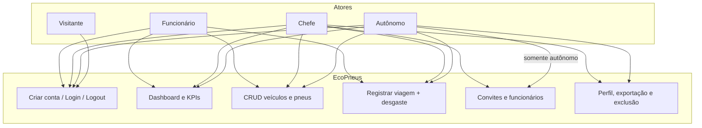
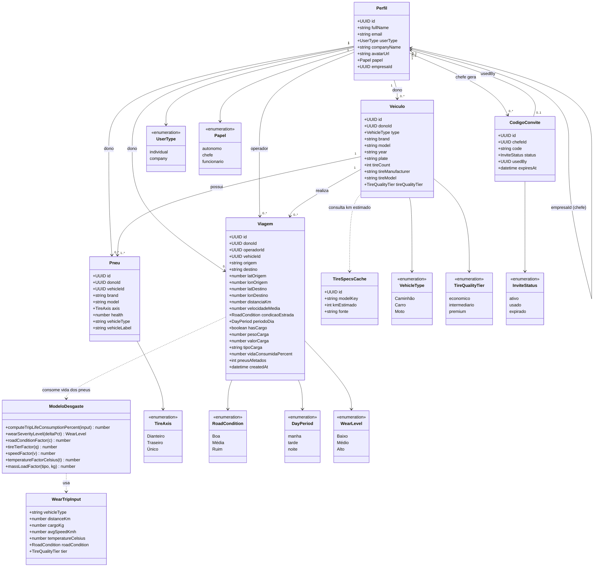

# EcoPneus — Requisitos e diagramas (Mermaid)

Documentação alinhada à implementação atual (React + TypeScript + Supabase).  
Cole os blocos `mermaid` no [Mermaid Live Editor](https://mermaid.live), em Markdown do GitHub ou no Overleaf com o pacote `mermaid`.

---

## 1. Diagrama de casos de uso

```mermaid
flowchart LR
  Visitante([Visitante])
  Autonomo([Autônomo])
  Chefe([Chefe])
  Funcionario([Funcionário])

  subgraph Sistema["Sistema EcoPneus"]
    subgraph Auth["Autenticação"]
      UC01["UC01 Consultar landing page"]
      UC02["UC02 Criar conta PF/PJ"]
      UC03["UC03 Fazer login"]
      UC04["UC04 Fazer logout"]
    end

    subgraph Painel["Painel"]
      UC05["UC05 Visualizar dashboard"]
    end

    subgraph Frota["Frota"]
      UC06["UC06 Cadastrar veículo"]
      UC07["UC07 Listar e filtrar veículos"]
      UC08["UC08 Remover veículo"]
      UC09["UC09 Consultar vida estimada do pneu"]
    end

    subgraph Pneus["Pneus"]
      UC10["UC10 Listar e filtrar pneus"]
      UC11["UC11 Cadastrar / editar / substituir pneu"]
      UC12["UC12 Monitorar saúde do pneu"]
    end

    subgraph Viagens["Viagens"]
      UC13["UC13 Planejar rota no mapa"]
      UC14["UC14 Registrar viagem"]
      UC15["UC15 Pré-visualizar desgaste"]
      UC16["UC16 Listar e filtrar viagens"]
    end

    subgraph Equipe["Hierarquia empresarial"]
      UC17["UC17 Gerar código de convite"]
      UC18["UC18 Ingressar em empresa"]
      UC19["UC19 Gerenciar funcionários"]
      UC20["UC20 Desvincular funcionário"]
      UC21["UC21 Consultar resumo do motorista"]
    end

    subgraph Conta["Conta e dados"]
      UC22["UC22 Editar perfil e avatar"]
      UC23["UC23 Alterar senha"]
      UC24["UC24 Exportar frota e viagens"]
      UC25["UC25 Excluir conta"]
    end
  end

  Visitante --> UC01
  Visitante --> UC02
  Visitante --> UC03

  Autonomo --> UC04
  Autonomo --> UC05
  Autonomo --> UC06
  Autonomo --> UC07
  Autonomo --> UC08
  Autonomo --> UC09
  Autonomo --> UC10
  Autonomo --> UC11
  Autonomo --> UC12
  Autonomo --> UC13
  Autonomo --> UC14
  Autonomo --> UC16
  Autonomo --> UC18
  Autonomo --> UC22
  Autonomo --> UC23
  Autonomo --> UC24
  Autonomo --> UC25

  Chefe --> UC04
  Chefe --> UC05
  Chefe --> UC06
  Chefe --> UC07
  Chefe --> UC08
  Chefe --> UC09
  Chefe --> UC10
  Chefe --> UC11
  Chefe --> UC12
  Chefe --> UC13
  Chefe --> UC14
  Chefe --> UC16
  Chefe --> UC17
  Chefe --> UC19
  Chefe --> UC20
  Chefe --> UC21
  Chefe --> UC22
  Chefe --> UC23
  Chefe --> UC24
  Chefe --> UC25

  Funcionario --> UC04
  Funcionario --> UC05
  Funcionario --> UC06
  Funcionario --> UC07
  Funcionario --> UC08
  Funcionario --> UC09
  Funcionario --> UC10
  Funcionario --> UC11
  Funcionario --> UC12
  Funcionario --> UC13
  Funcionario --> UC14
  Funcionario --> UC16
  Funcionario --> UC22
  Funcionario --> UC23

  UC14 -.->|include| UC15
  UC05 -.->|include| UC12
```

### Versão UML (sintaxe `C4` alternativa — `graph` de atores × casos)

Se o renderizador exigir o tipo `usecase` clássico, use este equivalente em `flowchart` (acima) ou o bloco abaixo no estilo *actor / system*:

---

## 2. Diagrama de classes (domínio)

### Relacionamentos (cardinalidade)

| Relação | Cardinalidade | Regra |
|---------|---------------|--------|
| Perfil ↔ Veículo | 1 : N | `dono_id` é sempre o autônomo ou o chefe |
| Veículo ↔ Pneu | 1 : N | exclusão do veículo remove os pneus (cascade) |
| Veículo ↔ Viagem | 1 : N | viagem referencia o veículo da frota |
| Perfil (operador) ↔ Viagem | 1 : N | `operador_id` = usuário autenticado que registrou |
| Chefe ↔ Funcionário | 1 : N | `empresa_id` no perfil do funcionário |
| Chefe ↔ CódigoConvite | 1 : N | código de 8 caracteres, 7 dias, uso único |

---

## 3. Requisitos de domínio (RD)

Regras do negócio de gestão de frota e vida útil de pneus.

| ID | Requisito |
|----|-----------|
| **RD01** | O sistema gerencia frotas de **Caminhão**, **Carro** e **Moto**. |
| **RD02** | Cada veículo possui um conjunto de pneus; a quantidade é determinada pelo tipo (Carro = 4, Moto = 2, Caminhão = 4 a 24). |
| **RD03** | A saúde do pneu é um percentual de **vida útil restante** no intervalo **[0, 100]**. Pneu novo inicia em 100%. |
| **RD04** | O eixo do pneu é **Dianteiro**, **Traseiro** ou **Único** (atribuição automática na criação em lote). |
| **RD05** | O consumo de vida por viagem segue o **modelo empírico**: fração `D / vida_nominal_km` modulada por condição da via `g(θ)`, qualidade do pneu `h(Q)`, velocidade, temperatura e massa total (tara + carga). |
| **RD06** | Vida nominal de referência: Moto **30 000 km**, Carro **50 000 km**, Caminhão **90 000 km**. |
| **RD07** | O desgaste percentual por viagem é limitado a um teto de **40%**. |
| **RD08** | Severidade do desgaste: **Baixo** (&lt; 2,5%), **Médio** (2,5–6%), **Alto** (≥ 6%). |
| **RD09** | Após registrar uma viagem, o percentual consumido é **subtraído da saúde de todos os pneus** daquele veículo. |
| **RD10** | Status operacional do pneu (tela de pneus): **Excelente** ≥ 80%, **Atenção** ≥ 50%, **Crítico** &lt; 50%. |
| **RD11** | Qualidade do pneu: **econômico**, **intermediário**, **premium** (fator de desgaste 1,12 / 1,00 / 0,88). |
| **RD12** | Condição da estrada: **Boa**, **Média**, **Ruim** (fatores 0,88 / 1,00 / 1,15). |
| **RD13** | Período do dia (**manhã / tarde / noite**) influencia a temperatura de referência quando não há medição meteorológica. |
| **RD14** | Há três papéis: **autônomo** (frota própria), **chefe** (dono da frota empresarial) e **funcionário** (opera a frota do chefe). |
| **RD15** | Cadastro **pessoa física** implica papel autônomo; **empresa** implica papel chefe. |
| **RD16** | Funcionário vincula-se ao chefe por **código de convite** (8 caracteres, 7 dias, uso único). Somente autônomo pode usar o convite. |
| **RD17** | A frota (veículos, pneus, viagens) pertence ao **dono** (`dono_id`). O funcionário opera dados cujo dono é o chefe. |
| **RD18** | Quem registra a viagem é o **operador** (`operador_id` = usuário autenticado). |
| **RD19** | Chefe **não pode excluir a conta** enquanto houver veículos ou funcionários vinculados. |
| **RD20** | Somente o chefe **desvincula** o funcionário; o funcionário não se desvincula sozinho. Ao desvincular, o papel volta a **autônomo**. |
| **RD21** | Remover um veículo **remove em cascata** os pneus associados. |
| **RD22** | Placa é armazenada em maiúsculas. |
| **RD23** | Viagem exige veículo da frota e **distância &gt; 0**. Carga é opcional. |
| **RD24** | Alerta de desgaste alto (≥ 6%) e de saúde crítica pós-viagem (&lt; 15%) no registro da viagem. |

Fórmula resumida do domínio (protótipo):

\[
\Delta\% = 100 \cdot \min\left(0{,}40,\; \frac{D}{L_{\text{nom}}} \cdot g(\theta) \cdot h(Q) \cdot f_v \cdot f_T \cdot f_m \right)
\]

---

## 4. Requisitos funcionais (RF)

O que o sistema deve **fazer**.

### Autenticação e acesso

| ID | Requisito | Prioridade |
|----|-----------|------------|
| **RF01** | Permitir cadastro com nome, e-mail, senha, tipo PF ou PJ (PJ exige razão social e CNPJ na UI). | Must |
| **RF02** | Permitir login com e-mail e senha (Supabase Auth ou fallback local). | Must |
| **RF03** | Permitir logout e invalidar a sessão local. | Must |
| **RF04** | Restringir `/app/*` a usuários autenticados. | Must |
| **RF05** | Exibir landing page pública com proposta de valor, funcionalidades e FAQ. | Should |

### Dashboard

| ID | Requisito | Prioridade |
|----|-----------|------------|
| **RF06** | Exibir KPIs: vida média dos pneus, quantidade de veículos, pneus e viagens. | Must |
| **RF07** | Exibir distribuição de saúde dos pneus (gráfico). | Must |
| **RF08** | Exibir mapa das rotas recentes e tabela das últimas viagens. | Should |

### Veículos

| ID | Requisito | Prioridade |
|----|-----------|------------|
| **RF09** | Cadastrar veículo (tipo, marca, modelo, ano, placa, quantidade e especificação de pneus). | Must |
| **RF10** | Ao cadastrar o veículo, criar automaticamente os pneus correspondentes com saúde 100%. | Must |
| **RF11** | Listar veículos e filtrar por tipo. | Must |
| **RF12** | Remover veículo (e pneus associados). | Must |
| **RF13** | Consultar quilometragem estimada do modelo de pneu no catálogo. | Should |

### Pneus

| ID | Requisito | Prioridade |
|----|-----------|------------|
| **RF14** | Listar pneus em cards com barra de saúde e badge de status. | Must |
| **RF15** | Cadastrar, editar, substituir e remover pneu vinculado a um veículo. | Must |
| **RF16** | Filtrar pneus por tipo de veículo. | Should |
| **RF17** | Indicar operadores que utilizaram o veículo (avatares a partir do histórico de viagens). | Could |

### Viagens

| ID | Requisito | Prioridade |
|----|-----------|------------|
| **RF18** | Planejar rota (origem/destino) no mapa (Mapbox) e obter distância, velocidade média, período e coordenadas. | Must |
| **RF19** | Obter temperatura ambiente por coordenadas (Open-Meteo) para o modelo de desgaste. | Should |
| **RF20** | Informar condição da via, carga (peso, valor, tipo) ou ausência de carga, e faixa de qualidade do pneu. | Must |
| **RF21** | Pré-visualizar o percentual de vida consumida antes de confirmar. | Must |
| **RF22** | Persistir a viagem e aplicar o desgaste nos pneus do veículo. | Must |
| **RF23** | Listar viagens, filtrar por tipo de veículo e identificar o operador. | Must |

### Hierarquia empresarial

| ID | Requisito | Prioridade |
|----|-----------|------------|
| **RF24** | Chefe gera código de convite. | Must |
| **RF25** | Autônomo usa o código para tornar-se funcionário da empresa. | Must |
| **RF26** | Chefe lista funcionários, consulta estatísticas/resumo do motorista e desvincula. | Must |
| **RF27** | Restringir a tela `/app/funcionarios` ao papel chefe. | Must |
| **RF28** | Funcionário visualiza o nome da empresa vinculada. | Should |

### Conta e dados

| ID | Requisito | Prioridade |
|----|-----------|------------|
| **RF29** | Editar perfil (nome, empresa) e enviar avatar (até 2 MB). | Should |
| **RF30** | Alterar senha (modo nuvem). | Should |
| **RF31** | Preferências locais: tema claro/escuro, unidades, notificações, padrões de frota. | Could |
| **RF32** | Exportar frota e viagens para Excel. | Should |
| **RF33** | Excluir conta, respeitando RN de dependentes do chefe. | Must |

---

## 5. Requisitos não funcionais (RNF)

Qualidade, restrições e atributos do sistema.

| ID | Categoria | Requisito |
|----|-----------|-----------|
| **RNF01** | **Usabilidade** | Interface em português, layout responsivo (mobile &lt; 768 px, tablet, desktop) com sidebar ou menu hambúrguer. |
| **RNF02** | **Usabilidade** | Feedback imediato em formulários (validação, toasts) e prévia de desgaste antes de gravar a viagem. |
| **RNF03** | **Desempenho** | SPA (Vite); carregamento inicial aceitável em banda larga típica; mapas sob demanda (Mapbox). |
| **RNF04** | **Disponibilidade** | Persistência principal na nuvem (Supabase). Sem variáveis de ambiente, o modo demonstração usa `localStorage` (viagens podem ficar só em memória). |
| **RNF05** | **Segurança** | Autenticação pelo Supabase Auth; senhas nunca persistidas em texto claro no cliente em modo nuvem. |
| **RNF06** | **Segurança** | **RLS** no PostgreSQL: autônomo/chefe acessam `dono_id = auth.uid()`; funcionário acessa frota do chefe; `operador_id` na inserção da viagem deve ser o usuário autenticado. |
| **RNF07** | **Segurança** | Convites de uso único e expiração; RPC para gerar/usar/desvincular (não expor bypass de papel no cliente). |
| **RNF08** | **Privacidade** | Perfil visível a si mesmo; chefe vê funcionários; funcionário vê o chefe. Avatares em bucket autenticado. |
| **RNF09** | **Confiabilidade** | Integridade referencial (FK, cascade em pneus); disparadores impedem exclusão de chefe com dependentes. |
| **RNF10** | **Manutenibilidade** | TypeScript; domínio isolado em `src/app/domain` (`fleet`, `trip`, `wearModel`); contextos React para Auth, Fleet e Trips. |
| **RNF11** | **Portabilidade** | Aplicação web (PWA); deploy em Vercel. |
| **RNF12** | **Compatibilidade** | Navegadores modernos com ES modules (Chrome, Edge, Firefox, Safari atuais). |
| **RNF13** | **Integrações** | Mapbox (geocodificação e rota), Open-Meteo (temperatura), Supabase (Auth, Postgres, Storage). |
| **RNF14** | **Internacionalização** | Dados de frota e catálogo voltados ao mercado brasileiro (marcas, placas). |
| **RNF15** | **Acessibilidade** | Contraste de tema claro/escuro; componentes de formulário padronizados; não exige conformidade WCAG plena no protótipo. |
| **RNF16** | **Auditoria / rastreio** | Viagem registra operador, timestamps e coordenadas de origem/destino. |
| **RNF17** | **Escalabilidade** | Multi-usuário via RLS e `dono_id`; não há fila/backend próprio — escala com o plano Supabase. |
| **RNF18** | **Licenciamento / créditos** | Uso de Mapbox e dados meteorológicos sujeitos às cotas e termos dos provedores. |

---

## 6. Rastreabilidade resumida (RF × UC)

| Casos de uso | Requisitos funcionais |
|--------------|------------------------|
| UC01–UC04 | RF01–RF05 |
| UC05 | RF06–RF08 |
| UC06–UC09 | RF09–RF13 |
| UC10–UC12 | RF14–RF17 |
| UC13–UC16 | RF18–RF23, RD05–RD09 |
| UC17–UC21 | RF24–RF28, RD14–RD20 |
| UC22–UC25 | RF29–RF33 |

---

*Gerado a partir do código em `src/app/domain`, contextos, rotas e migrações Supabase (`001`–`008`).*
