# 📊 Resumo Visual - Sistema EcoPneu

## 🎯 Mapa do Sistema em 1 Minuto

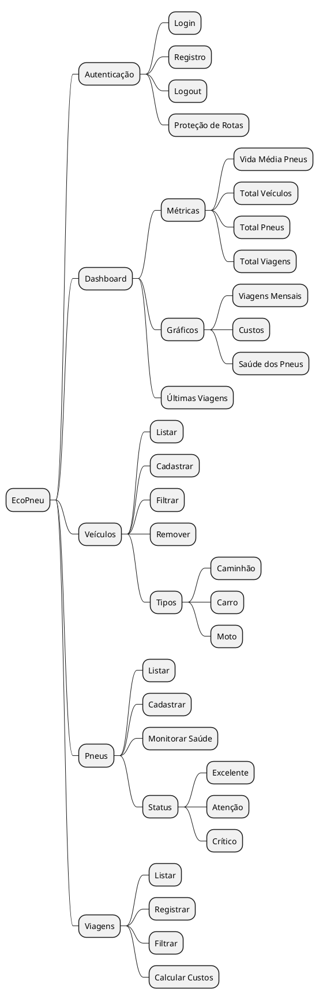

## 🔄 Fluxo do Usuário

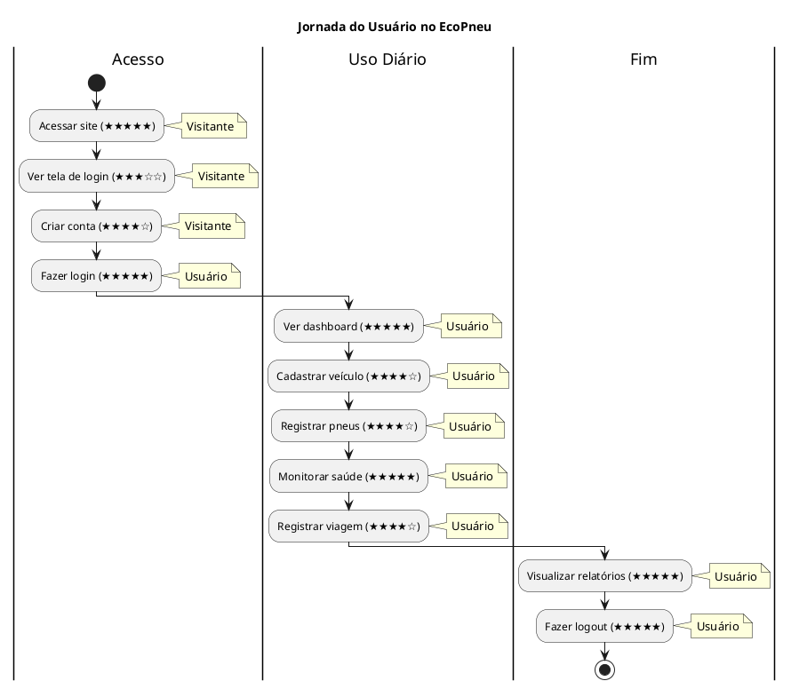

## 📦 Entidades Principais

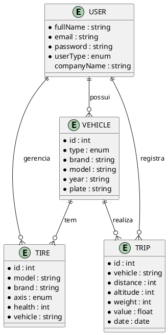

## 🏗️ Stack Tecnológico Visual

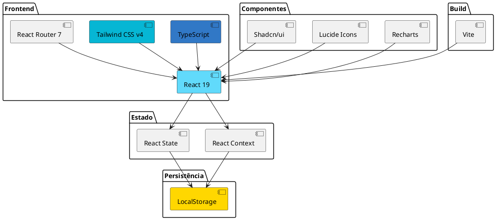

## 🎨 Paleta de Cores por Módulo

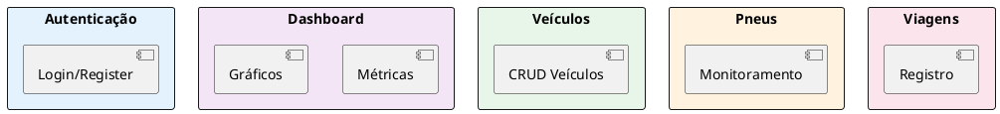

## 📱 Responsividade Visual

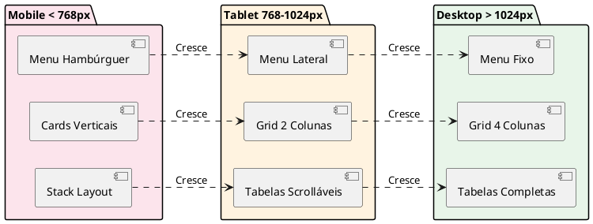

## 🔐 Fluxo de Autenticação Simplificado

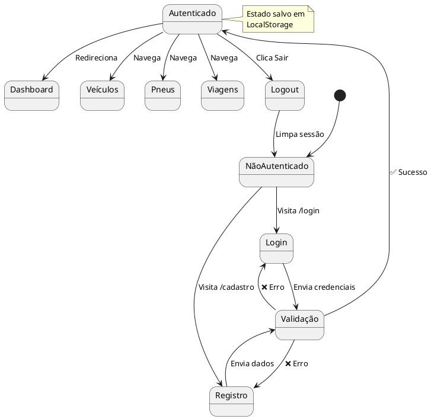

## 📊 Status de Saúde dos Pneus

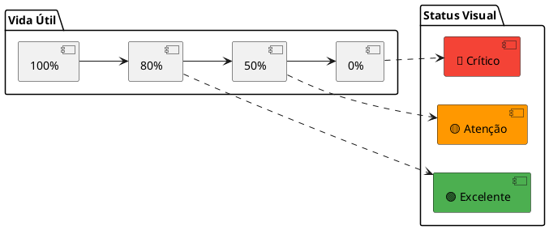

## 🎯 Cobertura Funcional

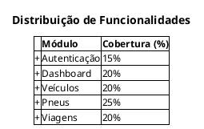

## 📈 Métricas do Dashboard

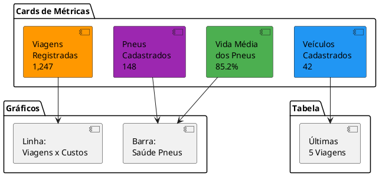

## 🔄 Ciclo de Vida de um Veículo

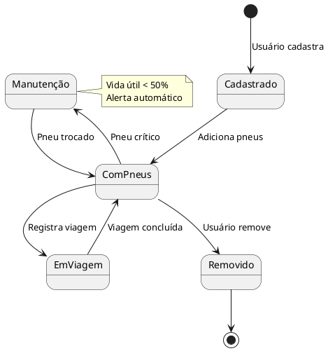

## 🎨 Hierarquia de Componentes

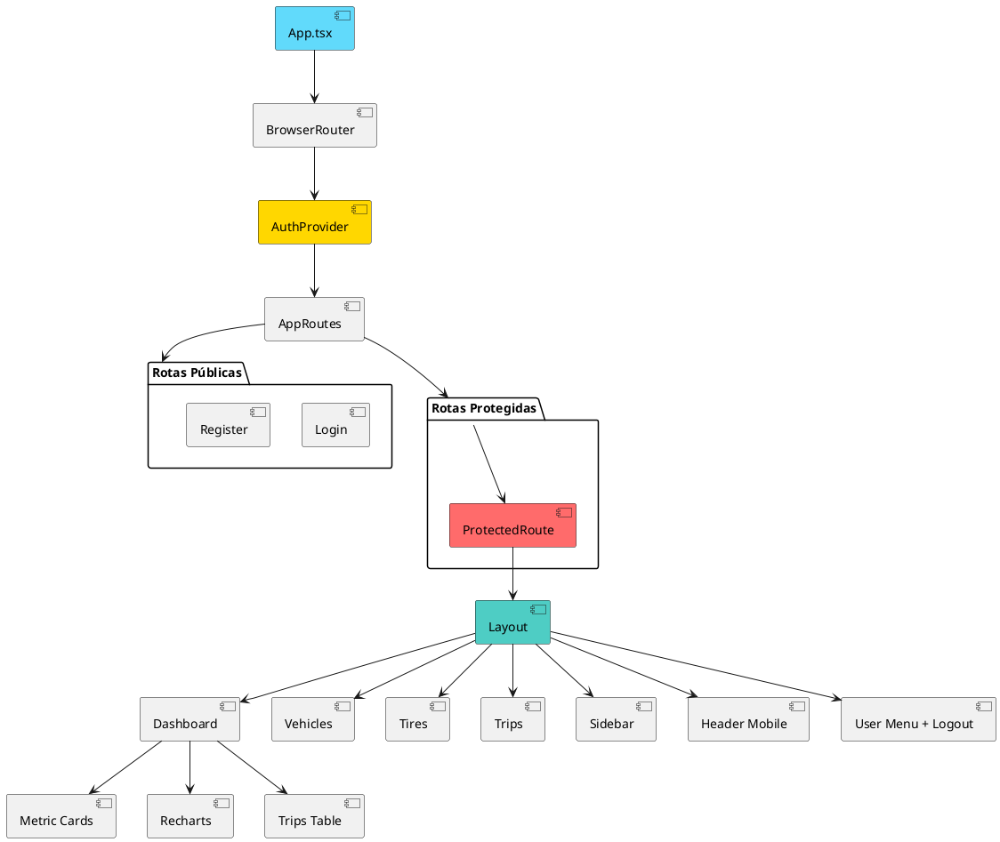

## 🚀 Quick Stats

| Métrica | Valor |
|---------|-------|
| 📄 Páginas | 7 |
| 🧩 Componentes | 50+ |
| 🎯 Casos de Uso | 18 |
| 📦 Classes | 13 |
| 🔀 Rotas | 7 |
| 🎨 Temas | Tailwind CSS v4 |
| 📱 Responsivo | 100% |
| 🔒 Seguro | Protected Routes |
| ⚡ Performance | Otimizado |

---

**💡 Dica:** Para detalhes completos, consulte os outros documentos:
- 📋 [Casos de Uso Completos](./diagrama-casos-de-uso.md)
- 🏗️ [Diagrama de Classes](./diagrama-classes.md)
- 🏛️ [Arquitetura Detalhada](./arquitetura-sistema.md)
- 📚 [README Principal](./README.md)
